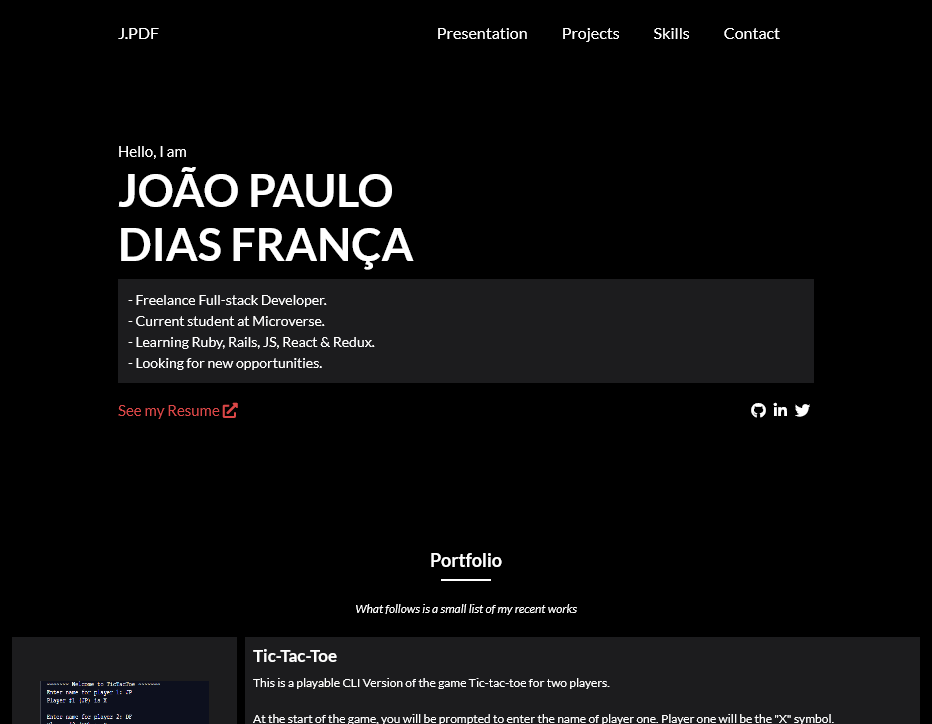

# My Portfolio

> A simple portfolio page higlighting some of my projects.

Additional description about the project and its features.

## Built With

- HTML
- CSS
- Bootstrap
- GitHub

## Live Demo

[Live Demo Link](https://jpdf00.github.io/portfolio-jpdf00/)

## Getting Started

**This is an example of how you may give instructions on setting up your project locally.**
**Modify this file to match your project, remove sections that don't apply. For example: delete the testing section if the currect project doesn't require testing.**

To get a local copy up and running follow these simple example steps.

### Install

 - Click on the button on the top called "Code".
 - Click in "Download ZIP".
 - Extract the content of the .zip file you just downloaded.
 - Open the index.html file using your browser of choice.

👤 **João Paulo Dias França**

- GitHub: [@jpdf00](https://github.com/jpdf00)
- Twitter: [@jpdf00](https://twitter.com/jpdf00)
- LinkedIn: [João Paulo Dias França](https://www.linkedin.com/in/jpdf00/)

## 🤝 Contributing

Contributions, issues, and feature requests are welcome!

Feel free to check the [issues page](https://github.com/jpdf00/portfolio-jpdf00/issues).

## Show your support

Give a ⭐️ if you like this project!

## Acknowledgments

- [José Oever González Hernández](https://github.com/NoTengoBattery) who was my partner on the Tic-Tac-Toe Project.

## 📝 License

This project is [MIT](/LICENSE) licensed.
